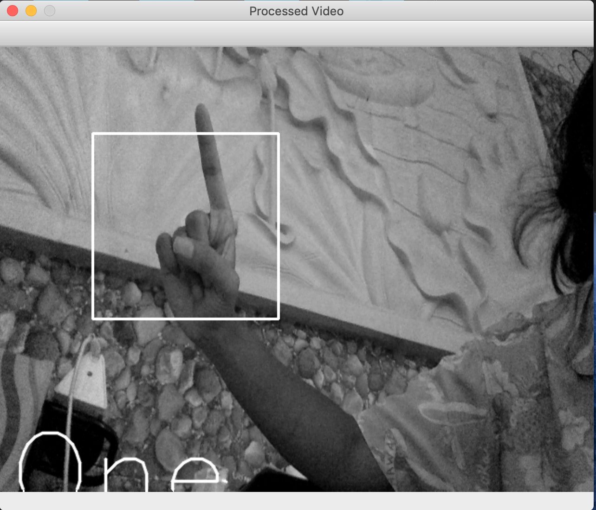
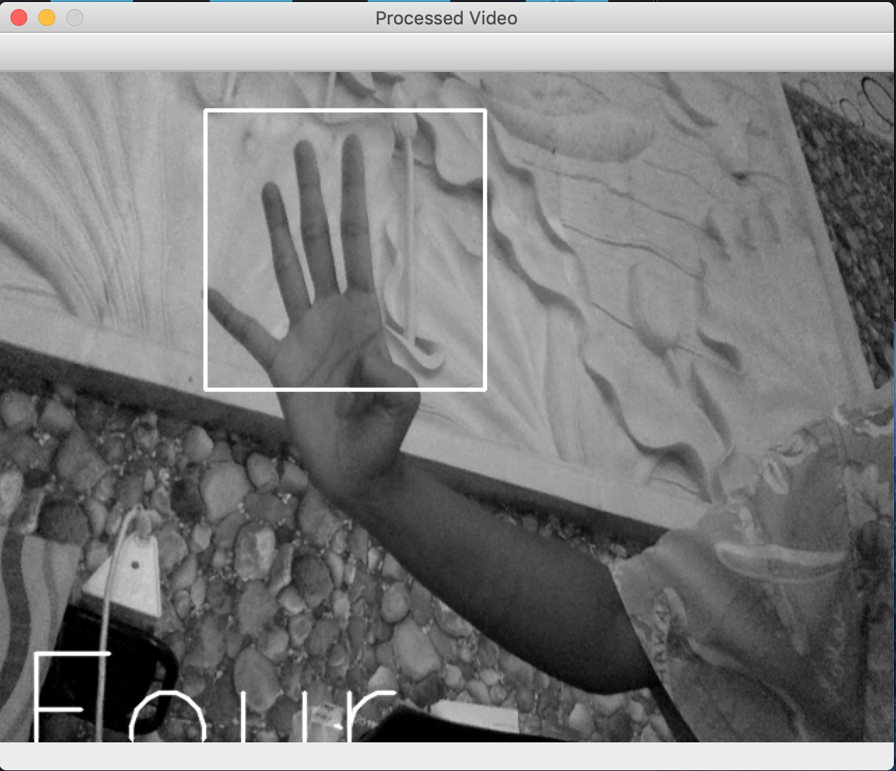
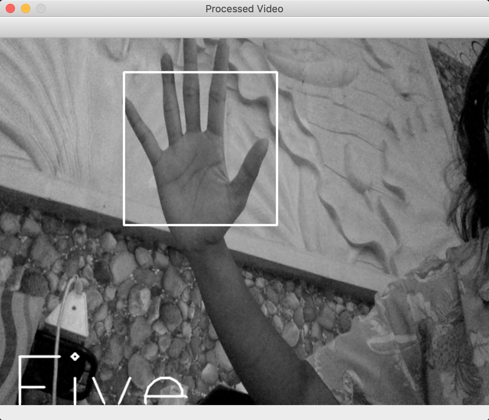

# finger_number_recognition
A very simple real-time hand gesture recognition to get the number representation using template matching. The implementation is done in Python, using the OpenCV library to capture video.

### Results

